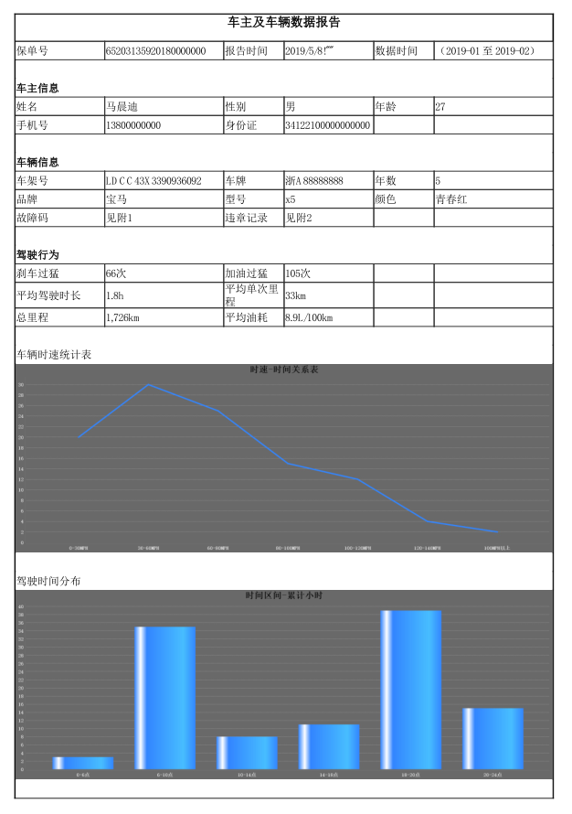

测试用例演示:

```java
class App {
    public static void main(String[] args){
        // 工厂类绘制折线图
        DrawLineChart drawLineChart = DrawChartFactory.INSTANCE.createLine();
       
       // 数据封装
       CategoryData lineData = new CategoryData();
       // lineData do something
       
       // 绘制统计图, 得到 IO
       InputStream line = drawLineChart.create("统计图标题", lineData);
       
       // 下面可以使用 IO, 如导出为图片
       BufferedImage img = ImageIO.read(in);
       
       ImageIO.write(img, "JPG", new File("/line.jpg"));
    }
}
```

# 采坑集合

1. `itext` 导出 HTML 模板时，HTML 模板不支持 `DIV`！仅仅支持 `table`。
2. `table` 在设置 `tr` 等宽高时不能直接在 `css` 中定义样式，因为在 `css` 中定义的样式并不起作用。想要设置宽高只能通过非标准元素控制，如下：

```html
<table width="100%">
    <tr>
        <td width="15%"></td>
        <td width="20%"></td>
        <td width="10%"></td>
        <td width="15%"></td>
        <td width="10%"></td>
        <td width="20%"></td>
    </tr>
</table>
```

> **注意：** 上面说的仅仅是对宽高不起作用，控制其他样式还是可以直接在 `css` 中定义的。

3. HTML 元素闭包标签问题，如  标签，一定样在显示的直接结束，即修改为 。
4. 该问题并没有遇到，应该是低版本的 `jfree` 包存在的问题，即不支持中文。

# 导出示例

在 `test/` 包下是测试用例，可以直接运行 `App.java` 类。最后 `report.ftl` 模板生成的 PDF 截图如下所示：



# 资源链接

- [使用 itext 将 html 页面转 pdf(完美支持中文)](https://hacpai.com/article/1528278305572)
- [java实现HTML转PDF](https://my.oschina.net/960823/blog/1588166)
- [JFree API](http://tool.oschina.net/apidocs/apidoc?api=jfreechart)
- [Java-jfree报表示例](https://www.cnblogs.com/newwind/p/5680389.html)